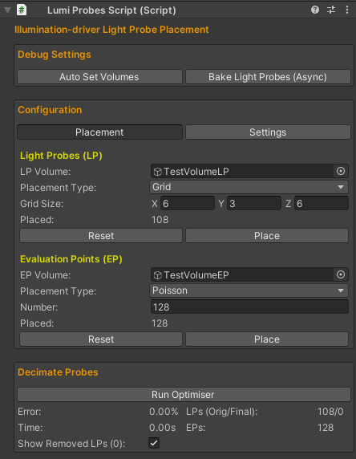
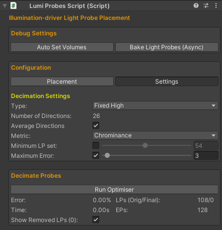
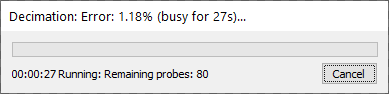
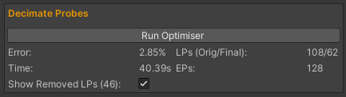
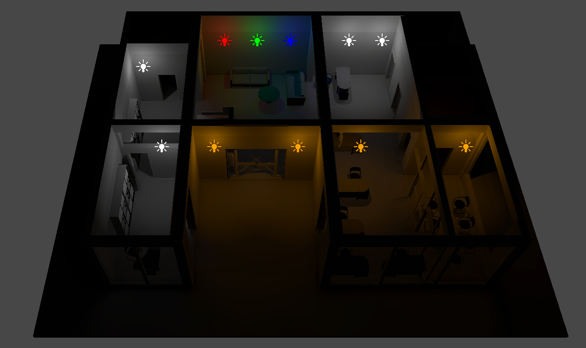
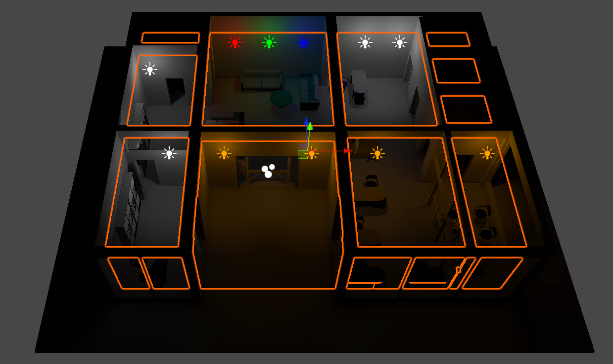
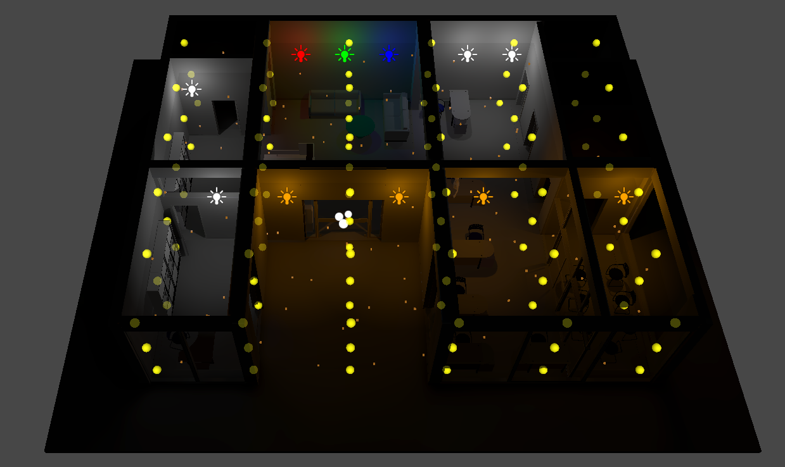
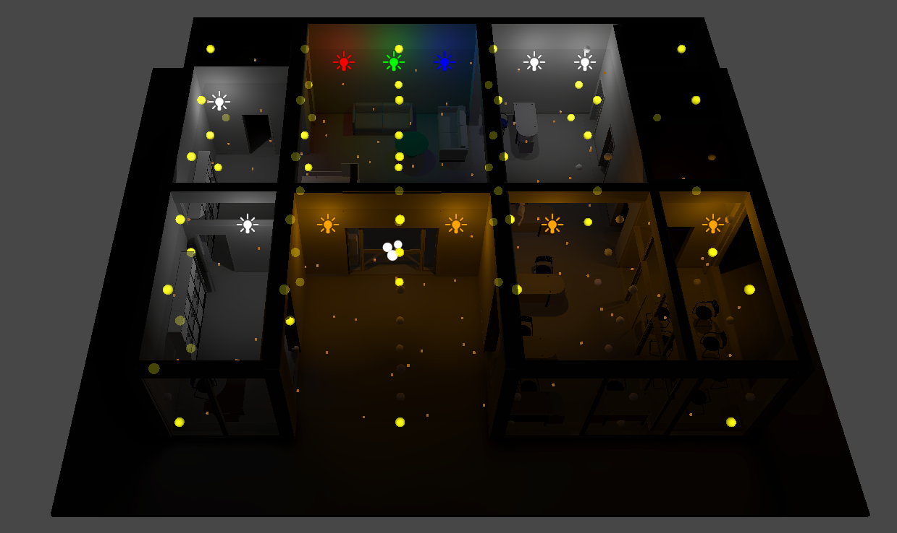

# Illumination-driven Light Probe Placement

## Overview
This repository contains the source code of a prototype implementation of for *[Eurographics 2021 Poster: Illumination-driven Light Probe Placement](https://diglib.eg.org/handle/10.2312/egp20211026)*, in the form of a Unity component.

Some helpful/quick links are:
- [Author version](https://kostasvardis.com/files/research/Illumination-driven%20Light%20Probe%20Placement%20-%20Author%20version.pdf) of the paper
- YouTube [short video presentation](https://www.youtube.com/watch?v=n3ACAjlhgJQ) (3 min)
- Direct link to the [source code](Light%20Probes/Assets/Scripts) of the Unity component. 
- The important source code parts are in the *DecimateLightProbes* function in the [LumiProbesScript.cs](Light%20Probes/Assets/Scripts/LumiProbes/LumiProbesScript.cs) file.

### Table of Contents

- [Algorithm Overview](#Algorithm-Overview)
- [Unity Component Instructions](#Unity-Component-Instructions)
- [How to Cite](#How-to-Cite)
- [Notes-Limitations](#Notes-Limitations)
- [Acknowledgments](#Acknowledgments)

## Algorithm Overview
This work proposes a light probe simplification method that preserves the indirect illumination distribution in scenes with diverse lighting conditions. This is accomplished through an iterative graph simplification algorithm that discards probes, according to a set of evaluation points, that have the least impact on the global light field.

  
  <i>Light Probe Simplification Pipeline</i>

Briefly, the steps of the algorithm are:

<ol style="list-style-type: decimal;">
    <li><strong>Setup</strong> (to generate the reference light probe configuration):
        <ol style="list-style-type: lower-alpha;">
            <li>Generate a (dense) set of light probes (LP)</li>
            <li>Compute the LPs radiance field (e.g. SH coefficients) and store them in a graph</li>
            <li>Generate a set of evaluation points (EP)</li>
            <li>Compute the EPs incident energy by sampling a set of directions around each EP. The incoming energy for each direction is determined by interpolating the k-nearest LPs from the graph</li>
            <li>Store the EP incident energy as a <it>reference</it></li>
        </ol>
    </li>
    <li><strong>Simplification</strong> (to perform the graph decimation).  While the requested <i>minimum LP</i> set and/or <i>maximum error</i> is not reached:
        <ol style="list-style-type: lower-alpha;">
            <li>Remove the LP with the minimum error:
                <ol style="list-style-type: lower-roman;">
                    <li>Select a candidate LP to remove and compute a new temp graph (with <i>n-1</i> LPs)</li>
                    <li>Compute the new radiance field for the EPs, as in <strong>1d</strong></li>
                    <li>Compute the error with the <it>reference</it> field as:
                        <ol style="list-style-type: upper-alpha;">
                        <li>Convert the RGB values to Luminance-Chrominance (YCoCg)</li>
                        <li>Compare the YCoCg values using different weights to preserve different illumination characteristics (E.g. Y=1,Co,Cg=0 for Luminance-driven and Y=0.1,Co,Cg=0.45 for Chrominance-driven simplification)</li>
                        </ol>
                    </li>
                    <li>Keep this graph configuration if it has the minimum error and go to <strong>i</strong></li>
                </ol>
            </li>
        <li>Replace graph with the <i>n-1</i> LP graph with the minimum error</li>
        </ol>
    </li>
</ol>

## Unity Component Instructions

### To Import
- Add a *Light Probe Group* object to your scene
- Import the contents [source code](Light%20Probes/Assets/Scripts) of the Unity component and add the *LumiProbes* script in the *Light Probe Group*

### To Run
- The component is configured in two panels: the Placement panel, which places the LPs and EPs, and the Settings Panel, which configures optimisation parameters:

    <figure style="vertical-align: top;display: inline-block;margin:0px;">
        
        <figcaption>Placement Panel</figcaption>
    </figure>
    <figure style="vertical-align: top;display: inline-block;margin:0px;">
        
        <figcaption>Settings Panel</figcaption>
    </figure>

- One these are set, click *Bake Light Probes (Async)* and *Run Optimiser*:

    <figure style="vertical-align: top;display: inline-block;margin:0px;">
        
        <figcaption>Optimisation Popup</figcaption>
    </figure>
    <figure style="vertical-align: top;display: inline-block;margin:0px;">
        
        <figcaption>Final Results Panel</figcaption>
    </figure>

The entire process is shown for the example scene below:

    <figure style="vertical-align: top;display: inline-block;margin:0px;">
        
        <figcaption>1. Original Scene</figcaption>
    </figure>
    <figure style="vertical-align: top;display: inline-block;margin:0px;">
        
        <figcaption>2. Add LP/EP Volume (if not, the scene bounds are used)</figcaption>
    </figure>
        <figure style="vertical-align: top;display: inline-block;margin:0px;">
        
        <figcaption>3. Add Light Probes</figcaption>
    </figure>
    <figure style="vertical-align: top;display: inline-block;margin:0px;">
        
        <figcaption>4. Add Evaluation Points</figcaption>
    </figure>
    <figure style="vertical-align: top;display: inline-block;margin:0px;">
        
        <figcaption>5. Final Light Probe set. If satisfied, *bake* the result</figcaption>
    </figure>

All info is logged in a *LumiProbes_log.txt*.

## How to Cite
The license is [MIT](LICENSE). If you use the contents of this repository for your work, please cite it as described below:

### LaTeX and BibTeX example usage

<blockquote>
<pre style="white-space:pre-wrap;">
In our work, we have used the source code~\cite{Vardis_2021_EG_2021_Poster}, available at <em>'https://github.com/cgaueb/light_probe_placement'</em>.
</pre>

<pre style="white-space:pre-wrap;">
@article{Vardis_2021_EG_2021_Poster,
    booktitle = {Eurographics 2021 - Posters},
    title = {{Illumination-driven Light Probe Placement}},
    author = {Vardis, Konstantinos and Vasilakis, Andreas-Alexandros and Papaioannou, Georgios},
    year = {2021},
    publisher = {The Eurographics Association},
}
</pre>
Note: A proper bibtex will be uploaded when the poster becomes published.
</blockquote>

## Notes-Limitations

- This is a preliminary version of this research work
- High-processing times are currently observed for high EP-LP counts. Various pipeline stages allow for useful optimisations, e.g. by exploiting spatial locality during the reconstruction of the new graphs.
- With respect to the component implementation, some parts could be more conformant with Unity's implementation guidelines for productions purposes.
- The component has been tested with Unity version 2021.1.4f1

Any advice/additions are welcome!

## Acknowledgments
This research is co-financed by Greece and the European Union (European Social Fund) through the Operational Programme "Human Resources Development, Education and Lifelong Learning 2014-2020" for the project "Modular Light Transport for Photorealistic Rendering on Low-power Graphics Processors" (5049904).

The *Office*, *Block15* and *TestProbes* scene in this repository have been created by the [CG AUEB Group](http://graphics.cs.aueb.gr). The *Sponza* model was obtained from [Morgan McGuire’s Computer Graphics Archive](https://casual-effects.com/data). The *Ethan* character and all other scripts are part or have been modified from the [Unity's Standard Assets](https://assetstore.unity.com/packages/essentials/asset-packs/standard-assets-for-unity-2018-4-32351).
