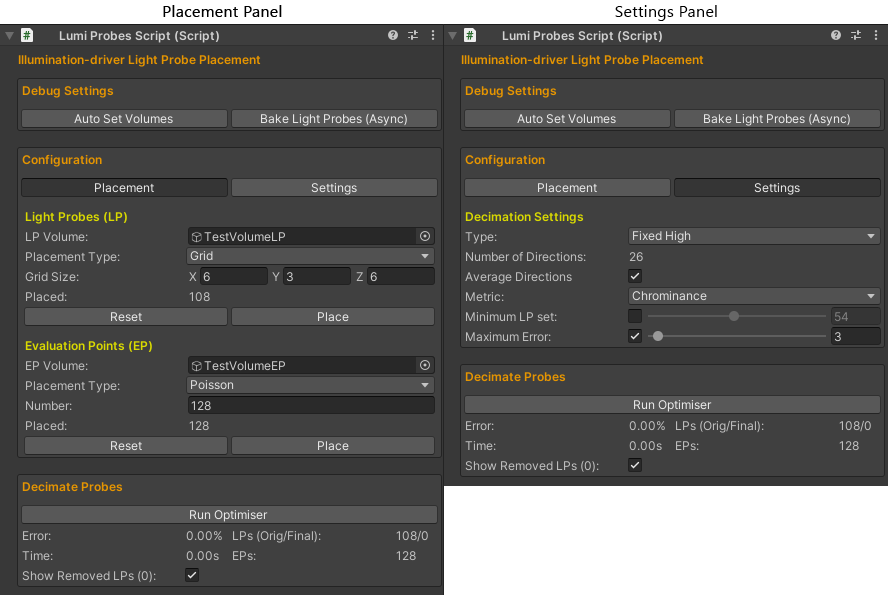
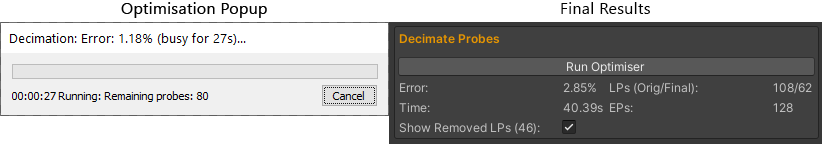
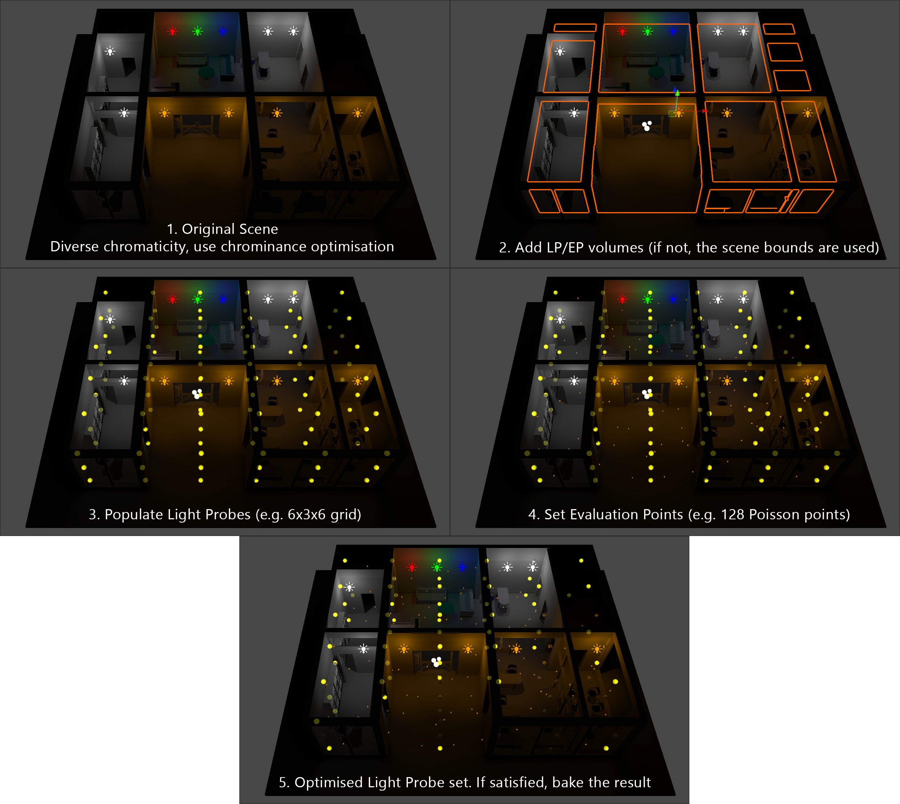

# Illumination-driven Light Probe Placement

## Overview
This repository contains the source code of a prototype implementation of the *[Eurographics 2021 Poster: Illumination-driven Light Probe Placement](https://diglib.eg.org/handle/10.2312/egp20211026)*, in the form of a Unity component. Some test scenes are also included. However, the source code can be simply added and used in a Unity project without the additional content in this repository.

Some helpful/quick links are:
- [Author version](https://kostasvardis.com/files/research/Illumination-driven%20Light%20Probe%20Placement%20-%20Author%20version.pdf) of the paper
- YouTube [short video presentation](https://www.youtube.com/watch?v=n3ACAjlhgJQ) (3 min)
- Direct link to the [unitypackage](unitypackage/lumiprobes.unitypackage), to directly import to your project 
- Direct link to the source code of the Unity component: [Scripts](Light%20Probes/Assets/Scripts/LumiProbes) and [Editor](Light%20Probes/Assets/Editor/LumiProbesEditor.cs)
- The important parts are located in the *DecimateLightProbes* function in the [LumiProbesScript.cs](Light%20Probes/Assets/Scripts/LumiProbes/LumiProbesScript.cs) file.

Key Features:
- Light Probe/Evaluation Point Placement Types: Grid (good for Light Probes), Stratified, Random, Poisson (good for Evaluation Points)
- Stopping Conditions: Minimum Probes and Maximum Error
- Two illumination-based simplification options:
    - Luminance, for scenes with similar light colours, i.e. to retain a higher probe density at regions with high luminance transitions
    - Chrominance, for scenes with contrasting light colours, i.e. to retain a higher probe density at regions with high chrominance variations

### Table of Contents

- [Algorithm Overview](#Algorithm-Overview)
- [Unity Component Instructions](#Unity-Component-Instructions)
- [How to Cite](#How-to-Cite)
- [Notes-Limitations](#Notes-Limitations)
- [Acknowledgments](#Acknowledgments)
- [References](#References)

## Algorithm Overview
This work proposes a light probe simplification method that preserves the indirect illumination distribution in scenes with diverse lighting conditions. This is accomplished through an iterative graph simplification algorithm that discards probes, according to a set of evaluation points, that have the least impact on the global light field.

Briefly, the algorithm consists of two stages: **Setup**, to generate the reference light probe configuration, and **Simplification**, to perform the graph decimation.

**Setup steps:**
1. Generate a (dense) set of light probes (LP)
2. Compute the LPs radiance field (e.g. SH coefficients) and store them in a graph
3. Generate a set of evaluation points (EP)
4. Compute the EPs incident energy by sampling a set of directions around each EP. The incoming energy for each direction is determined by interpolating the k-nearest LPs from the graph. Store either the result of each direction separately, or the *average* over all directions (approximate result, but less sensitive to outliers)
5. Store the EP incident energy as a *reference*
  
**Simplification steps:**
1. While the requested *minimum LP* set and/or *maximum error* is not reached:
    1. Iterate over all LPs
        1. Select a candidate LP to remove and compute a new temp graph (with *n-1* LPs)
        2. Compute the new radiance field for the EPs, as in **1iv**
        3. Compute the error with the *reference* field as:
            - Convert the RGB values to Luminance-Chrominance, like YCoCg [[MS03]](#[MS03])
            - Compare the YCoCg components using different weights to preserve different illumination characteristics (e.g. Y=1,Co,Cg=0 for Luminance-driven and Y=0.1,Co,Cg=0.45 for Chrominance-driven simplification)
            - Compute the final cost based on absolute percentage errors, e.g. [SMAPE](https://en.wikipedia.org/wiki/Symmetric_mean_absolute_percentage_error), or others
        4. Keep this graph configuration if it has the minimum error and go to **a**
    2. Replace graph with the *n-1* LP graph with the minimum error

## Unity Component Instructions

### To Import
- Add a [Light Probe Group](https://docs.unity3d.com/Manual/AssetPackagesCreate.html) object to your scene
- Import the contents [source code](Light%20Probes/Assets/Scripts) of the Unity component and add the *LumiProbes* script in the *Light Probe Group*

### To Run
- The component is configured in two panels: the Placement panel  (left), which places the LPs and EPs, and the Settings Panel (right), which configures optimisation parameters:
  

- Once these are set, click *Bake Light Probes (Async)* and *Run Optimiser* (right):

The entire process is also illustrated for a test scene below:

All messages are logged in the log file: *LumiProbes_log.txt*.

## How to Cite
The license is [MIT](LICENSE). If you use the contents of this repository for your work, please cite it as described below:

### LaTeX and BibTeX example usage

<blockquote>
<pre style="white-space:pre-wrap;">
In our work, we have used the source code~\cite{Vardis_2021_EG_2021_Poster}, available at <em>'https://github.com/cgaueb/light_probe_placement'</em>.
</pre>

<pre style="white-space:pre-wrap;">
@article{Vardis_2021_EG_2021_Poster,
    booktitle = {Eurographics 2021 - Posters},
    title = {{Illumination-driven Light Probe Placement}},
    author = {Vardis, Konstantinos and Vasilakis, Andreas-Alexandros and Papaioannou, Georgios},
    year = {2021},
    publisher = {The Eurographics Association},
}
</pre>
Note: A proper bibtex will be uploaded when the poster becomes published.
</blockquote>

## Notes-Limitations

- This is a preliminary version of this research work
- High-processing times are currently observed for high EP-LP counts. Various pipeline stages allow for useful optimisations, e.g. by exploiting spatial locality during the generation of the new graphs.
- With respect to the component implementation, some parts could be more conformant with Unity's implementation guidelines for productions purposes.
- The component has been tested with Unity version 2021.1.4f1

Any advice/additions are welcome!

## Acknowledgments
This research is co-financed by Greece and the European Union (European Social Fund) through the Operational Programme "Human Resources Development, Education and Lifelong Learning 2014-2020" for the project "Modular Light Transport for Photorealistic Rendering on Low-power Graphics Processors" (5049904).

The *Office*, *Block15* and *TestProbes* scenes in this repository have been created by the [CG AUEB Group](http://graphics.cs.aueb.gr). The *Sponza* model was obtained from [Morgan McGuire’s Computer Graphics Archive](https://casual-effects.com/data). The *Ethan* character and all other scripts are part or have been modified from the [Unity's Standard Assets](https://assetstore.unity.com/packages/essentials/asset-packs/standard-assets-for-unity-2018-4-32351).

## References

- <a name="[MS03]">[MS03]</a>Malver H., Sullivan G.: [YCoCg-R: A Color Space with RGB Reversibility and Low Dynamic Range](https://www.microsoft.com/en-us/research/publication/ycocg-r-a-color-space-with-rgb-reversibility-and-low-dynamic-range/). Tech. Rep. JVTI014r3. 21, Joint Video Team (JVT) of ISO/IEC MPEG & ITU-T VCEG, July 2003.
